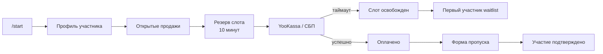

# WhoopMania Bot


Telegram-бот для регистрации участников, продажи билетов и управления
гонками WhoopMania.

Бот хранит профиль участника отдельно от его участия в конкретной гонке,
резервирует места на время оплаты, подтверждает платежи через YooKassa и
автоматически продвигает лист ожидания.

## Возможности

- регистрация участника с принятием регламента и обработкой персональных данных;
- отдельные статусы участия для каждой гонки;
- создание гонок и управление количеством мест;
- оплата участия через СБП и YooKassa;
- резервирование слота на 10 минут;
- защита от поздней оплаты уже переуступленного слота;
- автоматический лист ожидания;
- подтверждение формы пропуска;
- ручная запись участника без оплаты;
- изолированный тест платежа без открытия продаж;
- административная статистика и фильтры участников;
- работа через SOCKS5-прокси Telegram.

## Как устроен поток



Профиль в таблице `users` создается один раз. Участие и статус для каждой
гонки хранятся в `race_entries`.

## Быстрый старт

### 1. Окружение

```bash
python3 -m venv .venv
source .venv/bin/activate
pip install -r requirements.txt
```

### 2. Конфигурация

Создайте `.env` в корне проекта:

```dotenv
BOT_TOKEN=telegram-bot-token
RACE_CHANNEL_ID=-1001234567890
ADMIN_CHAT_ID=123456789
ADMIN_IDS=123456789,987654321

YOOKASSA_SHOP_ID=shop-id
YOOKASSA_SECRET_KEY=secret-key

PARTICIPATION_PRICE_RUB=2000
PAYMENT_DB_PATH=/path/to/shared/payment.db
```

Для Telegram-прокси можно указать готовый URL:

```dotenv
TELEGRAM_PROXY_URL=socks5://host:port
```

Или отдельные параметры:

```dotenv
TELEGRAM_PROXY_TYPE=socks5
TELEGRAM_PROXY_HOST=proxy-host
TELEGRAM_PROXY_PORT=1080
TELEGRAM_PROXY_USERNAME=
TELEGRAM_PROXY_PASSWORD=
```

Обязательные переменные:

| Переменная | Назначение |
|---|---|
| `BOT_TOKEN` | Токен Telegram-бота |
| `RACE_CHANNEL_ID` | Канал, подписка на который нужна для регистрации |
| `ADMIN_CHAT_ID` | Чат для административных уведомлений |
| `ADMIN_IDS` | Telegram ID администраторов через запятую |

`YOOKASSA_SHOP_ID` и `YOOKASSA_SECRET_KEY` обязательны для платежей.

### 3. База данных

```bash
cd database
../.venv/bin/python init_db.py
cd ..
```

Скрипт идемпотентен: его нужно выполнять после обновлений, содержащих изменения
схемы.

### 4. Запуск

```bash
python bot.py
```

Не запускайте второй polling-процесс с тем же `BOT_TOKEN`.

## Базы данных

Проект использует две SQLite-базы:

| База | Назначение |
|---|---|
| `database/race.db` | Гонки, профили, слоты, статусы участия и waitlist |
| `PAYMENT_DB_PATH` | Общая база платежей YooKassa |

`race.db` принадлежит этому проекту. Платежная база может совместно
использоваться другим сервисом, который обновляет статусы YooKassa.

Файлы `*.db` игнорируются Git и не должны попадать в коммиты.

## Административные команды

Полная актуальная справка доступна в Telegram:

```text
/admin
```

### Гонки и продажи

| Команда | Назначение |
|---|---|
| `/create_race YYYY-MM-DD SLOTS` | Создать гонку в статусе `draft` |
| `/open_sales` | Открыть последний черновик и разослать уведомления |
| `/add_slots COUNT` | Добавить места в активную гонку |
| `/delete_draft RACE_ID` | Удалить только пустой черновик |

`/create_race` не делает рассылку. Массовая рассылка начинается только после
`/open_sales`.

### Участники

| Команда | Назначение |
|---|---|
| `/users` | Сводка активной гонки |
| `/users all` | Все участники активной гонки |
| `/users profiles` | Все профили |
| `/users reserved` | Ожидают оплату |
| `/users paid` | Оплатили, форма еще не подтверждена |
| `/users form_confirmed` | Полностью записаны |
| `/users waitlist` | Лист ожидания |
| `/users expired` | Истекшие резервы |
| `/users cancelled` | Отмененные записи |
| `/add_user TELEGRAM_ID` | Записать пользователя без оплаты |

### Безопасная проверка оплаты

Создайте черновик и выполните:

```text
/test_payment 1
```

Команда создает реальный платеж на 1 ₽ только для вызвавшего ее администратора:

- гонка остается в статусе `draft`;
- пользователи не получают рассылку;
- платеж проходит через обычный watcher;
- подтверждение оплаты попадает в административный лог;
- администратор получает обычную форму пропуска.

После проверки:

```text
/reset_test_entry
```

Затем ошибочный или ненужный черновик можно удалить:

```text
/delete_draft RACE_ID
```

## Статусы участия

| Статус | Значение |
|---|---|
| `reserved` | Слот ожидает оплату |
| `paid` | Платеж подтвержден, форма еще не подтверждена |
| `form_confirmed` | Участие полностью оформлено |
| `waitlist` | Пользователь ожидает свободное место |
| `expired` | Время резерва истекло |
| `cancelled` | Участие отменено администратором |

## Тестирование

Проект использует стандартный `unittest`:

```bash
python -m unittest discover -s tests -v
```

Дополнительные проверки:

```bash
python -m compileall -q bot.py background_tasks.py config.py database handlers payments tests
python -m pip check
sqlite3 database/race.db "PRAGMA integrity_check;"
```

Тесты работают на временных SQLite-базах и не изменяют рабочую `race.db`.

## Развертывание

Типовое обновление:

```bash
git pull --ff-only
source .venv/bin/activate
pip install -r requirements.txt
cd database
../.venv/bin/python init_db.py
cd ..
sudo systemctl restart wupomania-bot.service
sudo systemctl status wupomania-bot.service --no-pager
```

Перед заменой рабочей базы:

1. остановите процесс, который может писать в нее;
2. выполните `PRAGMA integrity_check`;
3. создайте timestamp-копию текущего файла;
4. загружайте новую базу во временное имя;
5. заменяйте файл атомарно;
6. повторно проверьте целостность.

## Структура проекта

```text
.
├── bot.py                    # Точка запуска и регистрация routers
├── background_tasks.py       # Истечение резервов
├── config.py                 # .env и общие настройки
├── database/
│   ├── db.py                 # Подключения к SQLite
│   └── init_db.py            # Идемпотентная инициализация схемы
├── handlers/
│   ├── admin.py              # Административные команды
│   ├── payments_watcher.py   # Подтверждение платежей
│   ├── registration.py       # Регистрация профиля
│   ├── sales.py              # Покупка, форма и отмена
│   ├── start.py              # /start
│   └── waitlist.py           # Передача свободного слота
├── payments/
│   └── service.py            # Создание платежа YooKassa
└── tests/                    # Изолированные unit-тесты
```

## Безопасность

- Никогда не коммитьте `.env`, токены, секреты YooKassa, базы и логи.
- Не публикуйте реальные Telegram ID участников.
- Не запускайте `/open_sales` для тестирования.
- Перед ручными изменениями SQLite делайте резервную копию.
- Поздние и спорные платежи требуют ручной проверки и не должны автоматически
  подтверждать переуступленный слот.
